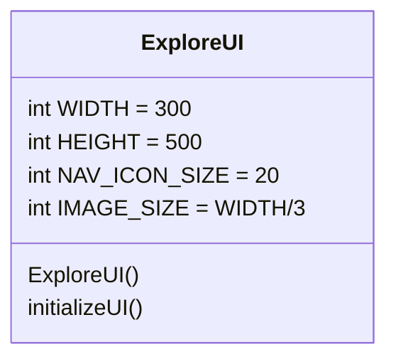

```mermaid
classDiagram
ExploreUI : int WIDTH = 300
ExploreUI : int HEIGHT = 500
ExploreUI : int NAV_ICON_SIZE = 20
ExploreUI : int IMAGE_SIZE = WIDTH/3
ExploreUI : ExploreUI()
ExploreUI : initializeUI()
```
