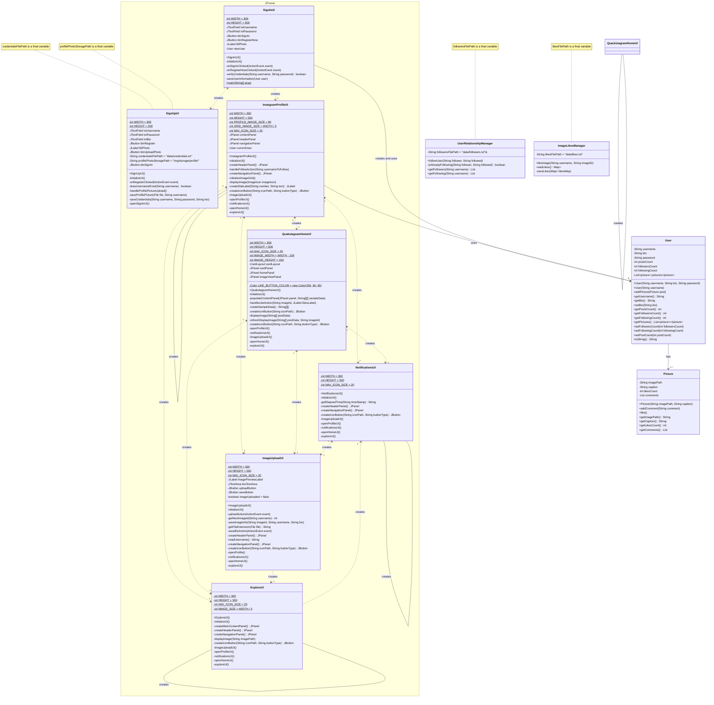

```mermaid
classDiagram

namespace JFrame{
class SignInUI
class SignUpUI
class InstagramProfileUI
class QuakstagramHomeUI
class NotificationsUI
class ExploreUI
class ImageUploadUI
}

SignInUI --> "1" User : creates and uses
SignInUI ..> "1" InstagramProfileUI : creates
SignInUI "1" <..> "1" SignUpUI : creates

InstagramProfileUI -- InstagramProfileUI : creates
InstagramProfileUI --> "1" User : uses
InstagramProfileUI "1" <..> "1" QuakstagramHomeUI : creates
InstagramProfileUI "1" <..> "1" NotificationsUI : creates
InstagramProfileUI "1" <..> "1" ExploreUI : creates
InstagramProfileUI "1" <..> "1" ImageUploadUI : creates

QuackstagramHomeUI -- QuackstagramHomeUI : creates
QuakstagramHomeUI "1" <..> "1" NotificationsUI : creates
QuakstagramHomeUI "1" <..> "1" ExploreUI : creates
QuakstagramHomeUI "1" <..> "1" ImageUploadUI : creates

NotificationsUI -- NotificationsUI : creates
NotificationsUI "1" <..> "1" ImageUploadUI : creates

ExploreUI -- ExploreUI : creates
ExploreUI ..> "1" NotificationsUI : creates

ImageUploadUI ..> "1" ExploreUI : creates

User --> "0..*" Picture : has

class SignInUI{
-int WIDTH = 300$
-int HEIGHT = 500$
-JTextField txtUsername
-JTextField txtPassword
-JButton btnSignIn
-JButton btnRegisterNow
-JLabel lblPhoto
-User newUser
+SignInUI()
-initializeUI()
-onSignInClicked(ActionEvent event)
-onRegisterNowClicked(ActionEvent event)
-verifyCredentials(String username, String password) boolean
-saveUserInformation(User user)
+main(String[] args)$
}

note for SignUpUI "credentialsFilePath is a final variable"
note for SignUpUI "profilePhotoStoragePath is a final variable"
class SignUpUI{
-int WIDTH = 300$
-int HEIGHT = 500$
-JTextField txtUsername
-JTextField txtPassword
-JTextField txtBio
-JButton btnRegister
-JLabel lblPhoto
-JButton btnUploadPhoto
-String credentialsFilePath = "data/credentials.txt"
-String profilePhotoStoragePath = "img/storage/profile/"
-JButton btnSignIn
+SignUpUI()
-initializeUI()
-onRegisterClicked(ActionEvent event)
-doesUsernameExist(String username) boolean
-handleProfilePictureUpload()
-saveProfilePicture(File file, String username)
-saveCredentials(String username, String password, String bio)
-openSignInUI()
}

class QuakstagramHomeUI{
-int WIDTH = 300$
-int HEIGHT = 500$
-int NAV_ICON_SIZE = 20$
-int IMAGE_WIDTH = WIDTH - 100$
-int IMAGE_HEIGHT = 150$
-Color LIKE_BUTTON_COLOR = new Color(255, 90, 95)$
-CardLayout cardLayout
-JPanel cardPanel
-JPanel homePanel
-JPanel imageViewPanel
+QuakstagramHomeUI()
-initializeUI()
-populateContentPanel(JPanel panel, String[][] sampleData)
-handleLikeAction(String imageId, JLabel likesLabel)
-createSampleData() String[][]
-createIconButton(String iconPath) JButton
-displayImage(String[] postData)
-refreshDisplayImage(String[] postData, String imageId)
-createIconButton(String iconPath, String buttonType) JButton
-openProfileUI()
-notificationsUI()
-ImageUploadUI()
-openHomeUI()
-exploreUI()
}

class InstagramProfileUI{
-int WIDTH = 300$
-int HEIGHT = 500$
-int PROFILE_IMAGE_SIZE = 80$
-int GRID_IMAGE_SIZE = WIDTH / 3$
-int NAV_ICON_SIZE = 20$
-JPanel contentPanel
-JPanel headerPanel
-JPanel navigationPanel
-User currentUser
+InstagramProfileUI()
-initializeUI()
-createHeaderPanel() JPanel
-handleFollowAction(String usernameToFollow)
-createNavigationPanel() JPanel
-initializeImageGrid()
-displayImage(ImageIcon imageIcon)
-createStatLabel(String number, String text) JLabel
-createIconButton(String iconPath, String buttonType) JButton
-ImageUploadUI()
-openProfileUI()
-notificationsUI()
-openHomeUI()
-exploreUI()
}

class ImageUploadUI{
-int WIDTH = 300$
-int HEIGHT = 500$
-int NAV_ICON_SIZE = 20$
-JLabel imagePreviewLabel
-JTextArea bioTextArea
-JButton uploadButton
-JButton saveButton
-boolean imageUploaded = false
+ImageUploadUI()
-initializeUI()
-uploadAction(ActionEvent event)
-getNextImageId(String username) int
-saveImageInfo(String imageId, String username, String bio)
-getFileExtension(File file) String
-saveBioAction(ActionEvent event)
-createHeaderPanel() JPanel
-readUsername() String
-createNavigationPanel() JPanel
-createIconButton(String iconPath, String buttonType) JButton
-openProfile()
-notificationsUI()
-openHomeUI()
-exploreUI()
}

class NotificationsUI{
-int WIDTH = 300$
-int HEIGHT = 500$
-int NAV_ICON_SIZE = 20$
+NotificationsUI()
-initializeUI()
-getElapsedTime(String timeStamp) String
-createHeaderPanel() JPanel
-createNavigationPanel() JPanel
-createIconButton(String iconPath, String buttonType) JButton
-ImageUploadUI()
-openProfileUI()
-notificationsUI()
-openHomeUI()
-exploreUI()
}

class ExploreUI{
-int WIDTH = 300$
-int HEIGHT = 500$
-int NAV_ICON_SIZE = 20$
-int IMAGE_SIZE = WIDTH / 3$
+ExploreUI()
-initializeUI()
-createMainContentPanel() JPanel
-createHeaderPanel() JPanel
-createNavigationPanel() JPanel
-displayImage(String imagePath)
-createIconButton(String iconPath, String buttonType) JButton
-ImageUploadUI()
-openProfileUI()
-notificationsUI()
-openHomeUI()
-exploreUI()
}

class User{
-String username
-String bio
-String password
-int postsCount
-int followersCount
-int followingCount
-List<Picture> pictures
+User(String username, String bio, String password)
+User(String username)
+addPicture(Picture post)
+getUsername() String
+getBio() String
+setBio(String bio)
+getPostsCount() int
+getFollowersCount() int
+getFollowingCount() int
+getPictures() List<Picture>
+setFollowersCount(int followersCount)
+setFollowingCount(int followingCount)
+setPostCount(int postCount)
+toString() String
}

note for UserRelationshipManager "followersFilePath is a final variable"
class UserRelationshipManager{
-String followersFilePath = "data/followers.txt"&
+followUser(String follower, String followed)
-isAlreadyFollowing(String follower, String followed) boolean
+getFollowers(String username) List<String>
+getFollowing(String username) List<String>
}

class Picture{
-String imagePath
-String caption
-int likesCount
-List<String> comments
+Picture(String imagePath, String caption)
+addComment(String comment)
+like()
+getImagePath() String
+getCaption() String
+getLikesCount() int
+getComments() List<String>
}

note for ImageLikesManager "likesFilePath is a final variable"
class ImageLikesManager{
-String likesFilePath = "data/likes.txt"
+likeImage(String username, String imageID)
-readLikes() Map<String, Set<String>>
-saveLikes(Map<String, Set<String>> likesMap)
}
```
