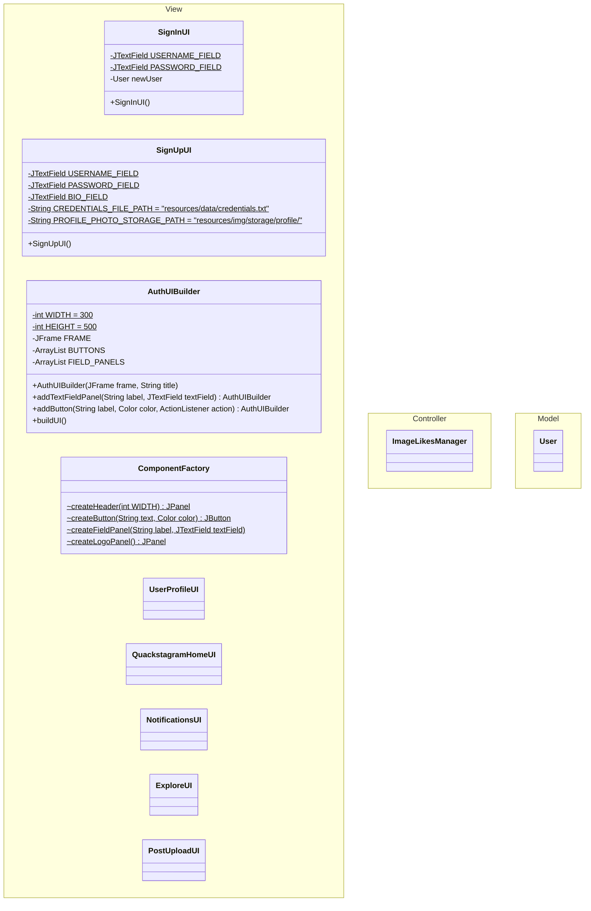

```mermaid
classDiagram

namespace View{
class SignInUI
class SignUpUI
class AuthUIBuilder
class ComponentFactory

class UserProfileUI
class QuackstagramHomeUI
class NotificationsUI
class ExploreUI
class PostUploadUI
}

namespace Controller{
class ImageLikesManager
}

namespace Model{
class User
}

class SignInUI{
-JTextField USERNAME_FIELD$
-JTextField PASSWORD_FIELD$
-User newUser
+SignInUI()
}

class SignUpUI{
-JTextField USERNAME_FIELD$
-JTextField PASSWORD_FIELD$
-JTextField BIO_FIELD$
-String CREDENTIALS_FILE_PATH = "resources/data/credentials.txt"$
-String PROFILE_PHOTO_STORAGE_PATH = "resources/img/storage/profile/"$
+SignUpUI()
}

class AuthUIBuilder{
-int WIDTH = 300$
-int HEIGHT = 500$
-JFrame FRAME
-ArrayList<JButton> BUTTONS
-ArrayList<JPanel> FIELD_PANELS
+AuthUIBuilder(JFrame frame, String title)
+addTextFieldPanel(String label, JTextField textField) AuthUIBuilder
+addButton(String label, Color color, ActionListener action) AuthUIBuilder
+buildUI()
}

class ComponentFactory{
~createHeader(int WIDTH) JPanel$
~createButton(String text, Color color) JButton$
~createFieldPanel(String label, JTextField textField)$
~createLogoPanel() JPanel$
}

```
