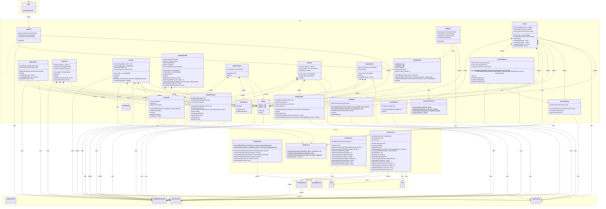

```mermaid
classDiagram

Main --> "1" SignInUI : creates
namespace App{
class Main { +main(String[] args)$ }
}

namespace Controller{
class AuthController
class NavigationController
class PostController
class UserController
}

namespace Model{
class Post
class User
}

namespace Repository{
class PostRepository
class UserRepository
}

namespace Services{
class AuthServices
class FileServices
class PostServices
class UserServices
}

namespace View{
%% authenticationUI
class AuthUIBuilder
class ComponentFactory
class SignInUI
class SignUpUI

%% components
class CommentButton
class CommentPanel
class HeaderPanel
class ImageGrid
class LikeButton
class NavigationPanel
class ProfileBody
class ProfileHeader
class UIBase
class UserNavPanel

%% coreUI
class EditProfileUI
class ExploreUI
class HomeUI
class ImageUploadUI
class NotificationsUI
class PostUI
class ProfileUI
class SearchUserUI
}

%% AUTH_UI CLASSES

SignInUI --|> UIBase : extends
SignInUI --> NavigationController : uses
SignInUI --> "1" AuthUIBuilder : uses
SignInUI ..> HeaderPanel

class SignInUI{
-AuthController final authController;
-JTextField final usernameField;
-JTextField final passwordField;
+SignInUI()
}

SignUpUI --|> UIBase : extends
SignUpUI --> NavigationController : uses
SignUpUI --> "1" AuthUIBuilder : uses
SignUpUI ..> HeaderPanel

class SignUpUI{
-AuthController final authController;
-JTextField final usernameField;
-JTextField final passwordField;
-JTextField final bioField;
+SignUpUI()
}

AuthUIBuilder --> ComponentFactory : uses
AuthUIBuilder --> HeaderPanel : uses

class AuthUIBuilder{
-int WIDTH = 300$
-int HEIGHT = 500$
-JFrame FRAME
-ArrayList<JButton> BUTTONS
-ArrayList<JPanel> FIELD_PANELS
+AuthUIBuilder(JFrame frame, String title)
+addTextFieldPanel(String label, JTextField textField) AuthUIBuilder
+addButton(String label, Color color, ActionListener action) AuthUIBuilder
+buildUI()
}

class ComponentFactory{
~createHeader(int WIDTH) JPanel$
~createButton(String text, Color color) JButton$
~createFieldPanel(String label, JTextField textField)$
~createLogoPanel() JPanel$
}

%% CORE_UI CLASSES

HomeUI --|> UIBase
HomeUI --> "1" UserController : uses
HomeUI *-- "1" HeaderPanel : creates
HomeUI *-- "1" NavigationPanel : creates
HomeUI --> "1" PostController: creates
HomeUI *-- "0..*" LikeButton : creates
HomeUI --> FileServices : uses
HomeUI --> NavigationController : uses

class HomeUI{
-int final width = this.getWidth()
-int final imageWidth = width - 100
-int final imageHeight = imageWidth
-JPanel final homePanel
-UserController final userController
+HomeUI()
-buildUI()
-populateContentPanel(JPanel panel, String[][] sampleData)
-createSampleData() String[][]
}

PostUI --|> UIBase : extends
PostUI --> "1" PostController : uses
PostUI *-- "1" CommentPanel : creates
PostUI *-- "1" HeaderPanel : creates
PostUI *-- "1" NavigationPanel : creates
PostUI --> FileServices : uses
PostUI *-- "1" LikeButton : creates
PostUI *-- "1" CommentButton : creates
PostUI *-- "1" UserNavPanel : creates

class PostUI{
-int final width = this.getWidth()
-int final imageDimension = width/2
-PostController final postController
-CommentPanel final commentPanel
+PostUI(PostController postController)
-buildPostUI()
-createBodyPanel() JPanel
-createImageLabel() JLabel
-createButtonsPanel() JPanel
-createInfoPanel() JPanel
}

ProfileUI --|> UIBase : extends
ProfileUI --> "1" UserController : uses
ProfileUI *-- "1" ProfileHeader : creates
ProfileUI *-- "1" NavigationPanel : creates
ProfileUI *-- "1" ImageGrid : creates

class ProfileUI{
-int final width = this.getWidth()
-int final imageSize = width / 3
-UserController final userController
-String final username
+ProfileUI(String username)
-buildUI()
}

EditProfileUI --|> UIBase : extends
EditProfileUI --> "1" UserController: uses
EditProfileUI --> "1" HeaderPanel : creates
EditProfileUI --> "1" NavigationPanel : creates
EditProfileUI --> NavigationController : uses

class EditProfileUI{
-int PROFILE_IMAGE_SIZE = 200
-UserController final userController
+EditProfileUI(UserController userController)
-buildUI()
+createBodyPanel() JPanel
+createEditPicturePanel() JPanel
+createBioPanel() JPanel
}

NotificationsUI --|> UIBase
NotificationsUI --> "1" UserController: uses
NotificationsUI *-- "1" HeaderPanel : creates
NotificationsUI *-- "1" NavigationPanel : creates

class NotificationsUI{
-UserController userController
+NotificationsUI()
-buildUI()
}

ImageUploadUI --|> UIBase
ImageUploadUI --> "1" UserController : uses
ImageUploadUI *-- "1" HeaderPanel : creates
ImageUploadUI *-- "1" NavigationPanel : creates

class ImageUploadUI{
-int final width = this.getWidth()
-int final height = this.getHeight()
-JLabel imagePreviewLabel
-JTextArea captionTextArea
-JButton uploadButton
-JButton saveButton
-UserController final userController
+ImageUploadUI()
-buildUI()
-uploadAction(ActionEvent event)
-getNextImageId(String username) int
-saveImageInfo(String imageId, String username, String caption)
-getFileExtension(File file) String
-saveCaptionAction(ActionEvent event)
}

ExploreUI --|> UIBase
ExploreUI *-- "1" HeaderPanel : creates
ExploreUI *-- "1" NavigationPanel : creates
ExploreUI *-- "1" ImageGrid : creates
ExploreUI --> NavigationController : uses

class ExploreUI{
-int final width = this.getWidth()
-int final imageSize = width / 3
-ImageGrid final imageGridPanel
-JPanel final mainContentPanel
+ExploreUI()
-buildUI()
-createMainContentPanel() JPanel
-createSearchPanel() JPanel
}

SearchUserUI --|> UIBase
SearchUserUI --> "1" UserController : uses
SearchUserUI *-- "1" HeaderPanel : creates
SearchUserUI *-- "1" NavigationPanel : creates
SearchUserUI *-- "0..*" UserNavPanel: creates

class SearchUserUI{
-UserController final userController
-String final filter
+SearchUserUI(String filter)
-buildUI()
-createBodyPanel() JPanel
}

%% COMPONENTS CLASSES

CommentButton --> "1" PostController : uses
CommentButton --> "1" CommentPanel : uses
CommentButton --> NavigationController : uses

class CommentButton{
-Color COMMENT_BUTTON_COLOR = new Color(175, 248, 170, 255)$
-PostController final postController
-boolean final navigateToPost
-CommentPanel final commentPanel
+CommentButton(PostController postController, CommentPanel commentPanel, boolean navigateToPost)
-refresh()
-buildCommentButton()
-handlePostNavigation()
-handleCommentAction()
}

CommentPanel --> "1" PostController : uses
CommentPanel --> FileServices : uses

class CommentPanel{
-PostController final postController
+CommentPanel(PostController postController)
-refreshCommentsPanel()
-buildCommentsPanel()
}

class HeaderPanel{
-String title
+HeaderPanel()
-buildHeaderPanel()
}

ImageGrid --> "1" PostController : creates
ImageGrid --> NavigationController : uses
ImageGrid --> FileServices : uses

class ImageGrid{
-int final imageSize;
-String filter;
-boolean final isExact;
+ImageGrid(String filter, int imageSize, boolean isExact)
+setFilter(String filter)
+refresh()
-initializeScrollGrid()
-createGrid() JPanel
}

LikeButton --> "1" PostController : uses

class LikeButton{
-Color  UNLIKED_BUTTON_COLOR = new Color(255, 153, 153, 255)$
-Color  LIKED_BUTTON_COLOR =  new Color(255, 90, 95)$
-PostController final postController
+LikeButton(PostController postController)
+refresh()
-buildLikeButton()
}

NavigationPanel --> NavigationController : uses
NavigationPanel --> "1" UserController : creates

class NavigationPanel{
-int NAV_ICON_SIZE = 20$
-UserController final userController
-JFrame final currFrame
+NavigationPanel(JFrame currFrame)
-buildNavigationPanel()
-createIconButton(String iconPath, String buttonType) JButton
-openProfileUI()
-openImageUploadUI()
-openNotificationsUI()
-openHomeUI()
-openExploreUI()
}

ProfileHeader --> NavigationController : uses
ProfileHeader --> "1" UserController : uses

class ProfileHeader{
-int PROFILE_IMAGE_SIZE = 80
-String final username
-UserController final userController
-JPanel statsPanel
+ProfileHeader(String username, UserController userController)
-refresh()
-buildHeaderPanel()
-createStatLabel(String number, String text) JLabel
-createProfileButton(boolean isCurrentUser, String LoggedInUsername) JButton
}

UIBase --> NavigationController : uses

class UIBase{
-WIDTH = 400$
-HEIGH = 600$
+UIBase()
-onExit()
}

UserNavPanel --> NavigationController : uses

class UserNavPanel{
-String final imageOwner
+UserNavPanel(String imageOwner)
-buildUI()
}

%% SERVICE CLASSES

AuthServices --> "1" User : creates

class AuthServices{
-String CREDENTIALS_FILE_PATH = "resources/data/credentials.txt"$
-String PROFILE_PHOTO_STORAGE_PATH = "resources/img/storage/profile/"$
+verifyCredentials(String username, String password) boolean
+doesUsernameExist(String username) boolean
+saveCredentials(String username, String password, String bio)
+uploadProfilePicture(String username) boolean
-saveProfilePicture(File file, String username)
-saveLoggedInUser(User user)
}

class FileServices{
+openFileChooser(String dialogTitle, String... extensions) File$
+getElapsedTimestamp(String timestamp) String$
+createScaledIcon(String path, int width, int height) ImageIcon$
+getAllImageIds() ArrayList<String>
}

PostServices --> "1" UserController : creates
PostServices --> "1" PostRepository : uses

class PostServices{
-PostRepository final postRepository
+PostServices()
+addCommentToPost(String imageId, String comment)
+getCommentsForPost(String imageId) ArrayList<String[]>
+addLikeToPost(String imageId)
+getLikesForPost(String imageId) int
+removeLikeFromPost(String imageId)
+isPostLiked(String imageId) boolean
+setNotification(String imageId, String type)
+getImageOwner(String imageId) String
+getImagePath(String imageId) String
+getPostCaption(String imageId) String
}

UserServices --> "1" User : uses
UserServices --> "0..*" Post : uses
UserServices --> "1" UserRepository : creates

class UserServices{
-UserRepository final userRepository
-String final username
-User final user
+UserServices(User user)
+initializeUserData()
+setBio(String bio)
+isFollowing(String currentUser, String loggedInUser) boolean
+unFollowUser(String follower, String followed)
+getPostPaths() List<Path>
+getAllUsers() ArrayList<String>
+changeBioData(String bio)
+followUser(String follower, String followed)
+getLoggedInUsername() String
+loadPostCount(String username) int
+loadFollowerCount(String username) int
+loadFollowingCount(String username) int
+loadBioData(String username) String
+loadUserPosts(String username) List<Post>
}

PostRepository --> "1" UserController : creates
```
