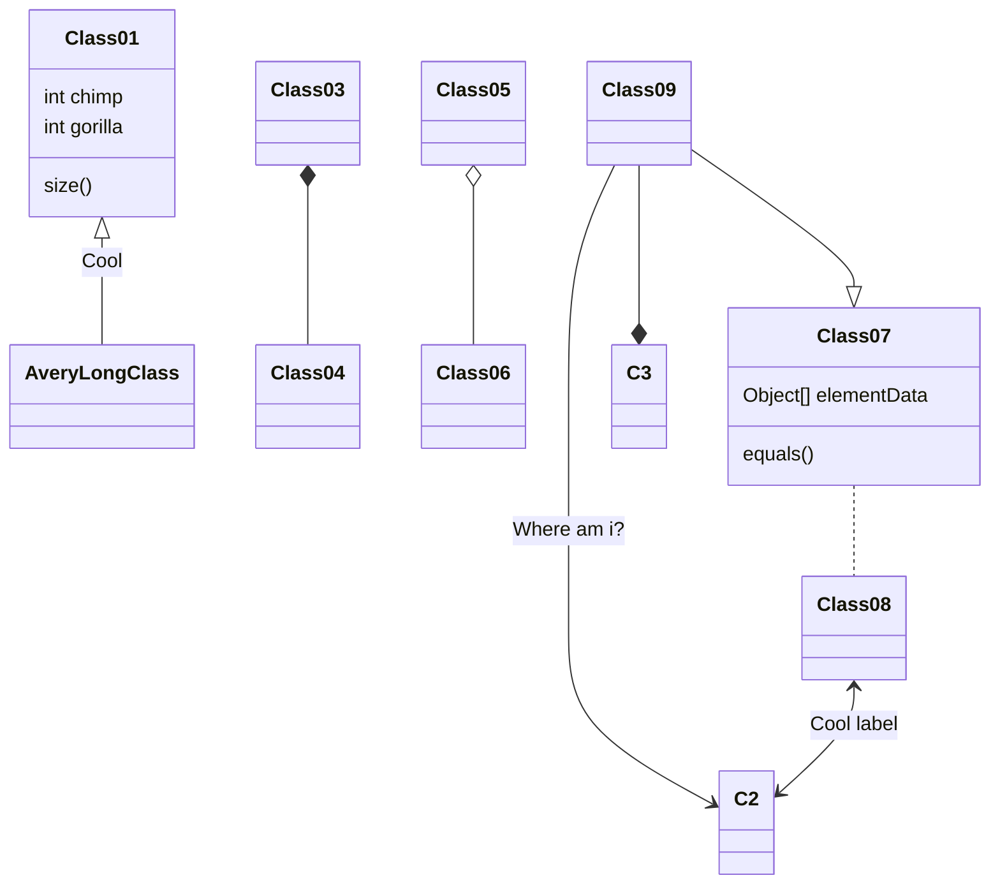

## Quackstagram

Scroll Down and check the documentation provided, the UI/UX inspo and the UML Design Chart

## Folder Structure

The workspace contains two folders by default, where:

- `src`: the folder to maintain sources
- `lib`: the folder to maintain dependencies

Meanwhile, the compiled output files will be generated in the `bin` folder by default.

## Dependency Management

The `JAVA PROJECTS` view allows you to manage your dependencies. More details can be found [here](https://github.com/microsoft/vscode-java-dependency#manage-dependencies).

## Design Chart

- UML(Temporary) Chart: https://drive.google.com/file/d/1uBblr-9sVkOjfDOg6As256iPZaHBJjVc/view?usp=sharing
- UML(Embedded) Chart:

## UI/UX Inspo sites

- mobbin: https://mobbin.com/browse/ios/apps
- dribble: https://dribbble.com/
- main-idea: https://dribbble.com/shots/24494696-Sign-In-Page

## Java Swing Useful Documentation

- Components: https://web.mit.edu/6.005/www/sp14/psets/ps4/java-6-tutorial/components.html
- Layouts: http://www.iitk.ac.in/esc101/05Aug/tutorial/uiswing/layout/visual.html
