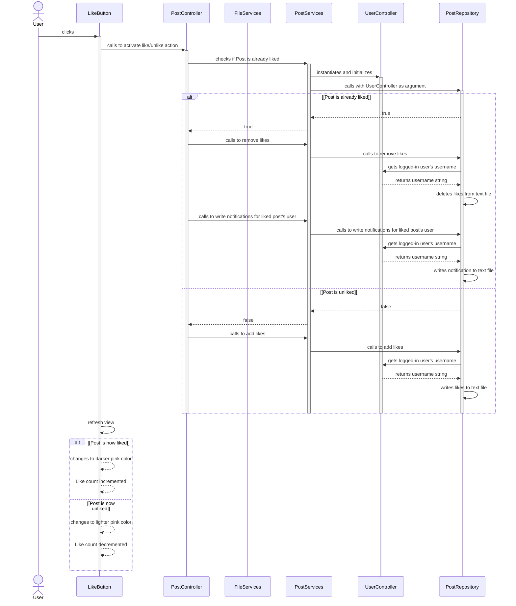

```mermaid
sequenceDiagram

actor User

participant LikeButton
participant PostController
participant FileServices

User ->>+ LikeButton : clicks
LikeButton ->>+ PostController : calls to activate like/unlike action
PostController ->>+ PostServices : checks if Post is already liked
PostServices ->>+ UserController : instantiates and initializes
PostServices ->>+ PostRepository : calls with UserController as argument
alt [Post is already liked]
    PostRepository -->> PostServices : true
    PostServices -->> PostController : true
    PostController ->> PostServices : calls to remove likes
    PostServices ->> PostRepository : calls to remove likes
    PostRepository ->> UserController : gets logged-in user's username
    UserController -->> PostRepository : returns username string
    PostRepository ->> PostRepository : deletes likes from text file
    PostController ->> PostServices : calls to write notifications for liked post's user
    PostServices ->> PostRepository: calls to write notifications for liked post's user
    PostRepository ->> UserController: gets logged-in user's username
    UserController -->> PostRepository: returns username string
    PostRepository ->> PostRepository: writes notification to text file
else [Post is unliked]
    PostRepository -->> PostServices : false
    PostServices -->> PostController : false
    PostController ->> PostServices : calls to add likes
    PostServices ->> PostRepository : calls to add likes
    PostRepository ->> UserController : gets logged-in user's username
    UserController -->> PostRepository : returns username string
    PostRepository ->> PostRepository : writes likes to text file
end

deactivate PostController
deactivate PostServices
deactivate PostRepository
deactivate UserController

LikeButton ->> LikeButton : refresh view
alt [Post is now liked]
    LikeButton -->> LikeButton : changes to darker pink color
    LikeButton -->> LikeButton : Like count incremented
else [Post is now unliked]
    LikeButton -->> LikeButton : changes to lighter pink color
    LikeButton -->> LikeButton : Like count decremented
end
deactivate LikeButton
```
